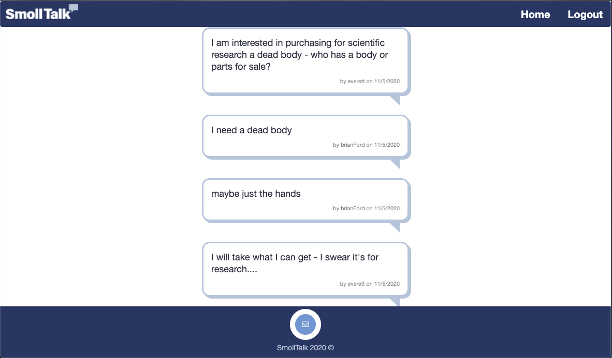

# smollTalk
<h1 align="center">smollTalk</h1>
  
<p align="center">
    
    
    
    
    
    
    
    
</p>
   
## Description

🔍 A mysql database and CMS-style chat site community built using Model View Controller (MVC) paradigm. 
  <br>Built using MySQL2, Express, Sequelize, Handlebars and dotenv. <br>
   As communities scale, guarantee your users a place to belong by empowering them to start conversations that matter. <br>
   Build a group channel to collaborate. Then grow your community with quality interactions in every conversation at once.<br>
   Users who are logged in will be able to create and comment on posts through a UI.

**[Deployed Application](https://limitless-shelf-64509.herokuapp.com/)**
  
💻 Below are screenshots of the application:
  





## Acceptance Criteria

```
GIVEN a CMS-style chat site
WHEN I visit the site for the first time 
THEN I am presented with the splash page with a login and signup option
WHEN I choose to sign up 
THEN I am prompted to create required fields: username, email, password, linkedin and optional fields:  github and twitter
WHEN I click on the sign-up button
THEN my user credentials are saved and I am logged into the site
WHEN I choose to login 
THEN I am prompted for username and password
WHEN I enter my username and password
THEN I am logged into the site
WHEN I am logged into the site 
THEN I am presented with a list of topics of conversation 
WHEN I choose a topic
THEN I am presented with messages that relate to selected topic
WHEN I submit a new message 
THEN my message is added to the end of the conversation
WHEN I click on Homepage in the navigation bar 
THEN I am returned to the list of topics
WHEN I click on the logout option in the navigation
THEN I am signed out of the site, returned to the Homepage with the login / sign-up option
```
   
## Table of Contents
- [Description](#description)
- [Acceptance Criteria](#acceptance-criteria)
- [Table of Contents](#table-of-contents)
- [Installation](#installation)
- [Usage](#usage)
- [Testing](#testing)
- [Contributing](#contributing)
- [Questions](#questions)

## Installation
💾   
  
`npm init`

`npm install`
  
## Backend Usage
💻   
  
Run the following command at the root of  project and answer the prompted questions:

`mysql -uroot -p`

Enter PW when prompted

`source db seed.sql`

`quit`

`npm start`

## Frontend Usage
💻 
`Required login to create a chat post: username, email, password, linkedin`

`Homepage displays Homepage displays all chats with comments count.  User can select to create a post.  User can Comment on other Users Chats. `

`Homepage allows user to create a post from a select list of topics and make comments on existing posts.`

## Testing

### similar to cypress run --browser <name>
npm run cypress:run -- --browser chrome
tested E2E front end 

## Contributing
:octocat: [Jenifer Queen](https://github.com/queen-stack)
[Nathalie](https://github.com/natswatch)
[Michael Dreesen](https://github.com/mdreesen)

## Questions
✉️ Contact me with any questions: [email](mailto:jenf_queen@yahoo.com) , [GitHub](https://github.com/queen-stack)<br/>


